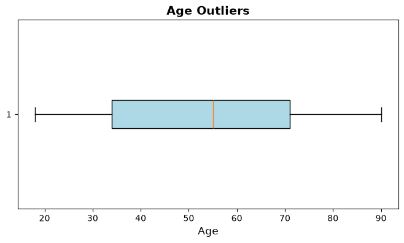
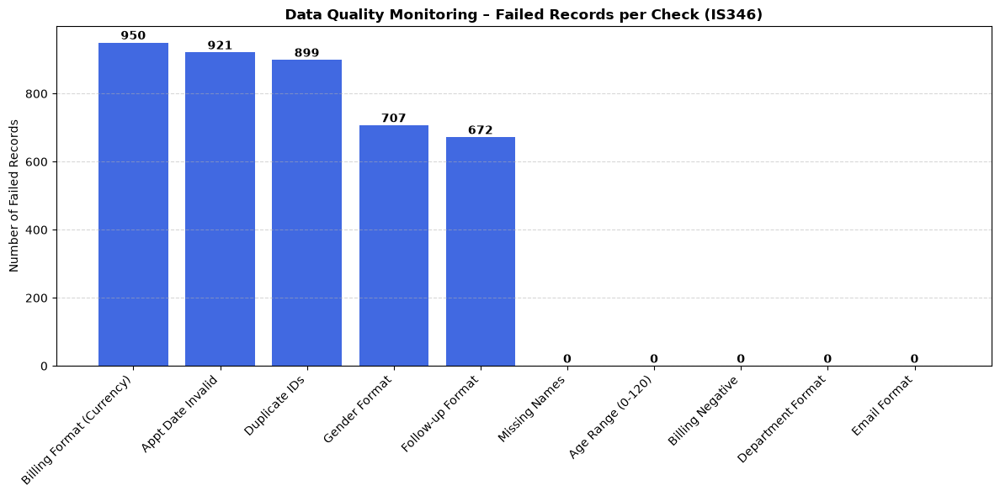
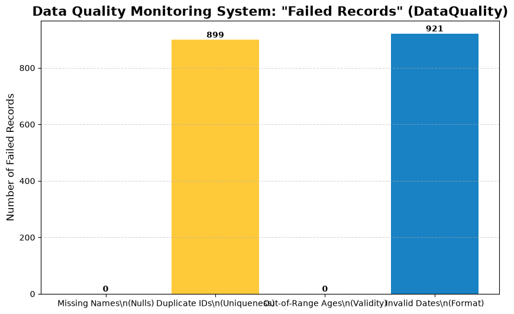
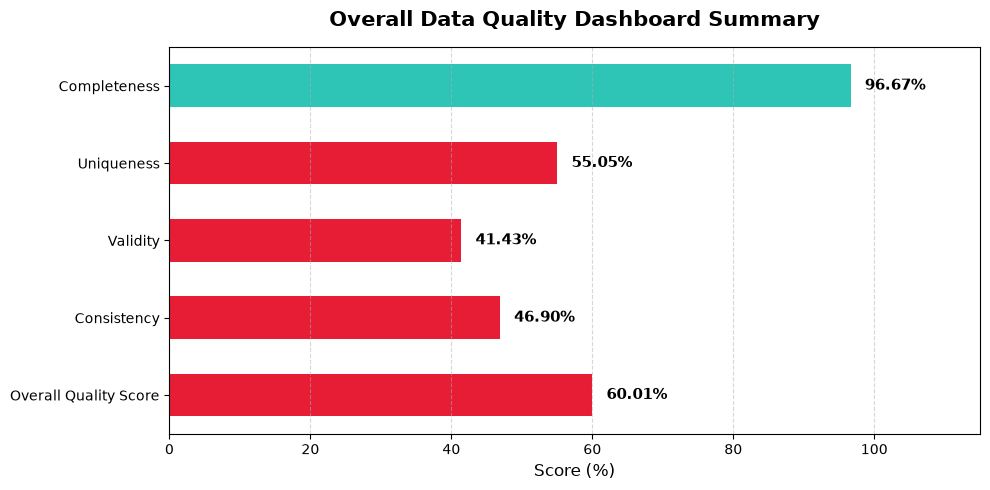

# Data-Quality-Monitoring-PoC
A Python-based Data Quality Monitoring pipeline that automatically profiles, validates, and flags anomalies in messy healthcare datasets.

## Project Deliverables
- 📄 **[Detailed Project Report (PDF)](MessyClinicAppointments_Report.pdf)**
- 📊 **[Project Presentation Slides (PDF)](Messy_Clinic_Appointment_DataSet_Presentation.pdf)**

Hi! This is a Data Quality Monitoring project I built using Python and Pandas.
 

For this project, I acted as a Data Quality Analyst tasked with finding errors in a simulated healthcare database. I used the Messy Clinic Appointments Dataset ,which definitely lives up to its name to build a prototype monitoring pipeline that catches bad data before it ruins a database.

## Tools Used
* Python
* Pandas for Data profiling and rule enforcement
* Matplotlib for Visualizing the failed records
* Google Colab

## What the Code Actually Does
I wrote a script that automatically scans incoming clinic data and flags rows that fail four major industry data quality rules:

1. Completeness: Are there missing patient names?
2. Uniqueness: Did the system generate duplicate Patient IDs?
3. Validity: Are the ages logically possible (0-120)? Did currency symbols (£, $) accidentally get typed into the billing amounts? Are genders formatted strictly as 'Male' and 'Female'?
4. Consistency: Do the appointment dates follow a strict format?

## The Biggest Finding
While running my consistency checks, my code flagged an incredible 92.4% failure rate in the appointment_date column. 

After digging into the data, I realized the clinic's front-end system doesn't have any data validation. Receptionists were just typing dates into a free-text box in dozens of different formats (like "12-Jun-2024" or "May 18"). 

My Recommendation: The permanent fix for this isn't just cleaning the data after the fact it's changing the UI to use a strict Calendar Date-Picker so users are forced into a standardized format right at the source.

## Future Improvements
This project was built entirely in pure Pandas to serve as a fast Proof of Concept (PoC). If I were to scale this up for a real enterprise hospital, I would migrate these exact Python rules into a dedicated testing framework like Great Expectations and automate the daily runs using Airflow.

## How to Run It
1. Clone this repo.
2. Make sure you have pandas, matplotlib, and kagglehub installed.
3. Run the notebook. The script will automatically pull the raw dataset directly from Kaggle and output the data profiling tables and the final bar chart of errors.

## Project Results

### 1. Age Outliers Analysis
We generated an outlier boxplot for the `age` attribute:

### 2. Quality Checks Implementation
We visualized the failed records count using two formats:

* **Detailed Quality Checks (IS346 - 10 Checks):**
  

* **Data Quality System Summary (DataQuality - 4 Checks):**
  

### 3. Data Quality Metrics Dashboard
This overall metrics summary visualizes our completeness, uniqueness, validity, consistency, and general quality score:

